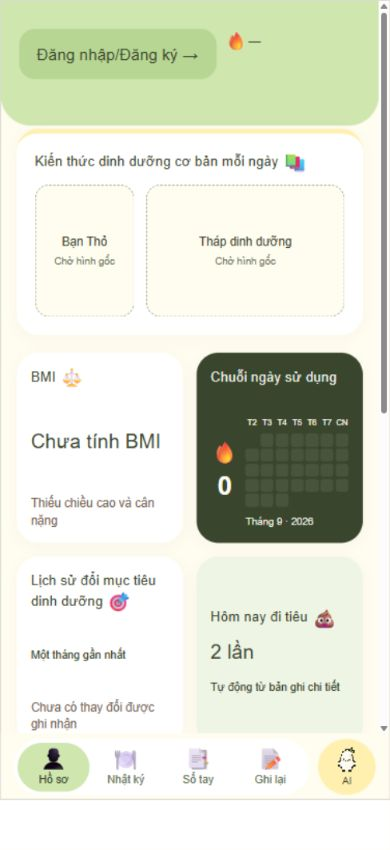
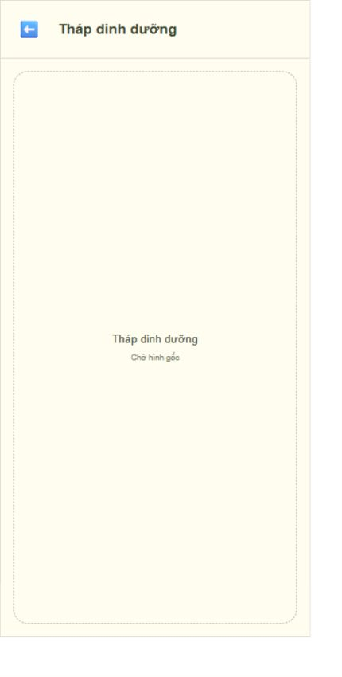
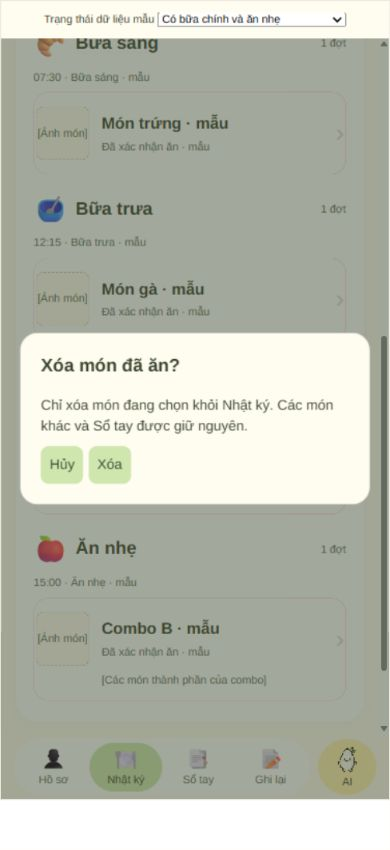
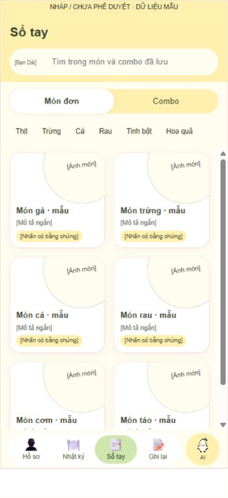
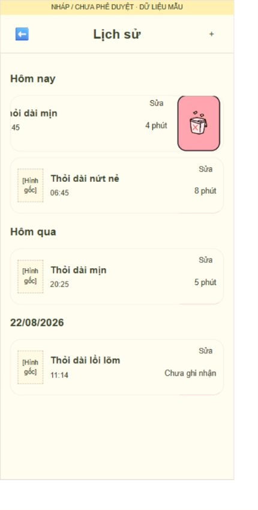

# SmartMeal AI — Báo cáo UX/UI và hướng dẫn bàn giao

**Phiên bản tài liệu: 1.0 · Ngày chốt wireframe: 27/09/2026 · Ngôn ngữ: Tiếng Việt.**

Người dùng xác nhận: “Bản wireframe này sẽ được chốt. Từ bản wireframe này tạo ra bản báo cáo UX/UI chi tiết từng trang giao diện và thao tác để người khác có thể chỉnh sửa dễ dàng.”

Tài liệu này mô tả bản wireframe hiện có, không phải đề xuất thiết kế mới và không thay thế PRD. Lượt bàn giao chỉ bổ sung tài liệu; không sửa giao diện, thuật toán hoặc PRD. Việc chốt bố cục và luồng không đồng nghĩa phê duyệt các hình nhân vật, nội dung dinh dưỡng, giọng đọc và dữ liệu mẫu còn để chờ.

## 1. Mốc bàn giao và cách sử dụng

| Hạng mục | Mốc xác định |
| --- | --- |
| Kho chính thức | [SmartMeal-AI trên GitHub](https://github.com/nguyenthihoanganh08112010-jpg/SmartMeal-AI) |
| Nhánh | `fix/smartmeal-layout-and-generation-time` |
| Bản nguồn đã chốt trên GitHub | `d66f16fef3b6de26d97e54716d140358fa2644fb` |
| Cây tệp tương ứng | `3e327197ff2f01baaa2105b88e6c625c992ed8b1` |
| Bản nguồn cục bộ tương đương | `d3ccb1f` — lịch sử commit khác nhưng cây tệp giống mốc GitHub |
| Đề nghị hợp nhất | [PR #1](https://github.com/nguyenthihoanganh08112010-jpg/SmartMeal-AI/pull/1), chưa coi là đã hợp nhất |
| Nguồn chỉnh sửa | `app/wireframe/`; xem bảng tệp ở mục 14 |
| Bản xem trước | `app/wireframe/smartmeal-update-preview.html`, được tạo bởi `build-update.py` |
| Phạm vi | Wireframe tương tác phía trình duyệt, dữ liệu mẫu; chưa phải ứng dụng vận hành thật |

Các nhãn “NHÁP / CHƯA PHÊ DUYỆT” trong ảnh và bản nguồn là nhãn lịch sử trước ngày chốt. Không sửa lại ảnh bằng chứng để xóa nhãn. Mốc chốt trong tài liệu này là căn cứ bàn giao mới; các tài sản chưa được duyệt vẫn giữ trạng thái chờ riêng.

**Cách đọc:** dùng mã màn hình để trao đổi yêu cầu; tra bảng thao tác để xác định hiệu ứng và dữ liệu chịu tác động; tra mục 14 để tìm tệp sửa. Trước khi sửa thành phần dùng chung, kiểm tra các màn hình sử dụng nó. Các con số CSS dưới đây là số đo của prototype hiện tại, không phải quy chuẩn thiết bị di động cuối cùng.

## 2. Danh mục màn hình và điều hướng

| Mã | Màn hình/trạng thái | Điểm vào chính | Điểm ra chính |
| --- | --- | --- | --- |
| H01 | Hồ sơ — chưa đăng nhập | Tab Hồ sơ, Back từ AI | Tài khoản, bốn tab còn lại |
| H02 | Hồ sơ — đã đăng nhập | Đăng nhập hoặc tab Hồ sơ | Sửa hồ sơ, Ghi lại, AI |
| H03 | Chuỗi ngày sử dụng và thông báo ngày mới | Lần vào đủ điều kiện trong ngày | Hồ sơ |
| H04 | Tháp dinh dưỡng toàn màn hình | Chạm vị trí tháp ở Hồ sơ | Về đúng vị trí Hồ sơ |
| H05 | Đổi/nhắc mục tiêu dinh dưỡng | Hồ sơ và nhắc theo lịch | Hồ sơ |
| A01–A08 | Tài khoản, xác minh, khôi phục, hồ sơ | Nút tài khoản hoặc điều kiện trước thao tác | Theo nguồn mở và trạng thái hồ sơ |
| D01 | Nhật ký — có dữ liệu/trống | Tab Nhật ký, cập nhật sau Đã ăn | Chi tiết dùng chung, tab khác |
| D02 | Xác nhận xóa một món đã ăn | Vuốt một món rồi chạm thùng rác | D01 giữ ngày và vị trí cuộn |
| S01 | Sổ tay — Món đơn | Tab Sổ tay | Chi tiết món, Combo |
| S02 | Sổ tay — Combo | Chuyển chế độ | Chi tiết combo, Món đơn |
| S03 | Tìm kiếm/lọc/trống/không kết quả | S01 hoặc S02 | Danh sách hiện hành |
| S04 | Vuốt xóa mục đã lưu | Một thẻ Sổ tay | Danh sách đã cập nhật |
| C01 | Chi tiết món dùng chung | Nhật ký, Sổ tay, AI, thành phần combo | Đúng màn nguồn |
| C02 | Chi tiết combo dùng chung | Nhật ký, Sổ tay, AI | C01 hoặc đúng màn nguồn |
| R01 | Ghi lại — màn Bạn Dài | Tab Ghi lại hoặc ô đi tiêu ở Hồ sơ | Biểu mẫu, Lịch sử, Phân tích nhật ký |
| R02 | Biểu mẫu Phân — mới/sửa/lỗi | Bắt đầu, dấu cộng, Sửa lịch sử | Phân tích sau lưu hoặc nguồn mở |
| R03 | Lịch sử tiêu hóa | Icon Lịch sử | R01, R02, R04 |
| R04 | Phân tích một bản ghi | Lưu thành công hoặc mở lịch sử | R01 sau lưu; R03 khi mở từ lịch sử |
| R05 | Phân tích nhật ký bảy ngày | Icon riêng tại R01 | R01 |
| I01 | AI — chào mừng | Tab AI khi chưa có cuộc trò chuyện | Tài khoản, gửi câu hỏi, điều kiện tạo món |
| I02 | AI — hội thoại đang diễn ra | Gửi tin/tiếp tục cuộc trò chuyện | H01/H02, P01, I03, chi tiết |
| I03 | Bảng xác nhận điều kiện | Yêu cầu đầu tiên hoặc yêu cầu chưa rõ | Tạo kết quả hoặc về hội thoại |
| I04 | AI — nhiều kết quả và xác nhận Đã ăn | Tạo/tạo lại kết quả | Nhật ký qua lưu dữ liệu, chi tiết dùng chung |
| I05 | Tiếp tục/Bắt đầu mới | Mở lại AI đã có hội thoại | Hội thoại hoặc Hồ sơ |
| I06 | Giọng nói và duyệt bản chép lời | Icon micro ở AI | Gửi tin hoặc trở về gõ chữ |
| P01 | Hồ sơ AI — xem thử/lưu nhân vật | Bánh răng góc phải AI | Giữ trang sau lưu hoặc về hội thoại |
| P02 | Rời Hồ sơ AI khi chưa lưu | Back có thay đổi | Lưu và rời, không lưu, tiếp tục chỉnh sửa |

Thanh điều hướng toàn ứng dụng giữ đúng thứ tự **Hồ sơ – Nhật ký – Sổ tay – Ghi lại – AI**. Màn AI, Hồ sơ AI và các màn chi tiết toàn màn hình không chồng thêm một thanh điều hướng thứ hai. Trình chọn trạng thái nằm ngoài khung điện thoại dùng để rà soát prototype, không phải tính năng dành cho người dùng.

## 3. Hệ thống hình thức và thành phần dùng chung

| Thành phần | Thiết kế hiện tại/cần giữ | Lưu ý khi chỉnh |
| --- | --- | --- |
| Màu xanh nền/nhấn | `#CFE6AF` | Dùng cho vùng xanh nhẹ, ô streak đã đạt |
| Màu vàng | `#FFF0B0` | Phân cấp dịu, không phủ vàng toàn bộ màn |
| Nền kem | `#FFFCF0` | Nền chung và các vùng lịch sử hài hòa |
| Màu chữ/chủ đạo đậm | `#39452D` | Nền thẻ streak; bảo đảm tương phản |
| Thẻ nội dung | Trắng, bo góc và bóng nhẹ theo từng component | Không đồng nhất mọi bán kính làm mất cấu trúc mẫu |
| Hành động xóa | Tài sản thùng rác hồng-đỏ gốc; vùng nhấn khoảng `#FFA5AF` | Chính sách xác nhận khác nhau theo màn |
| Icon chung | Microsoft Fluent Emoji Color; tài sản và đường dẫn trong nguồn | Gửi dùng Outbox tray; không tự vẽ lại icon gốc |
| AI trong thanh điều hướng | Hạt gạo pixel, tài sản trong `assets/` | Giữ nền trong suốt và tỷ lệ ảnh |
| Chữ | Arial/sans-serif trong prototype, phân cấp tiêu đề/nội dung/phụ chú | Chưa coi là quyết định bộ font thương hiệu chính thức |
| Khung xem trước | Rộng tối đa 390 CSS px, cao 800 CSS px | Đã đo lưới tại 320/360/390/430; đây không thay kiểm thử thiết bị thật |
| Nội dung dài | Cuộn ở vùng nội dung; hành động quan trọng cố định theo màn | Tránh footer đè dòng cuối, kiểm tra safe area khi triển khai |
| Hình chưa có | Ô giữ chỗ có vai trò rõ và nguồn thay thế riêng | Không coi hình thử nghiệm là tài sản cuối cùng |

Ảnh món phải gắn với món/combo khi tạo và được tái sử dụng ở AI, Sổ tay, Nhật ký và chi tiết. Ảnh minh họa không phải bằng chứng về chất dinh dưỡng. Mỗi thẻ giữ định danh riêng; không dùng vị trí trong danh sách làm khóa để xóa.

### 3.1. Ma trận thao tác xóa và hủy

| Ngữ cảnh | Đối tượng tác động | Xác nhận? | Dữ liệu phải giữ |
| --- | --- | --- | --- |
| Nhật ký | Một bản ghi món đã ăn | Có, overlay trên toàn danh sách | Món anh em, Sổ tay; giữ đợt nếu còn món |
| Sổ tay | Một mục đã lưu, món hoặc combo | Không | Toàn bộ lịch sử thực sự đã ăn |
| Lịch sử Ghi lại | Một bản ghi tiêu hóa | Có | Các bản ghi khác; tính lại dữ liệu phụ thuộc |
| Nút Xóa trong biểu mẫu Phân | Giá trị đang nhập chưa lưu | Không phải xóa bản ghi trong lịch sử | Bản ghi đã lưu trước đó |
| Bắt đầu mới AI | Hội thoại và kết quả chưa lưu | Có | Sổ tay, Nhật ký và dữ liệu lưu độc lập |
| Đóng/kéo xuống bảng điều kiện | Thay đổi điều kiện tạm | Hủy trực tiếp | Điều kiện đã xác nhận trước lần sửa |
| Rời Hồ sơ AI có thay đổi | Cấu hình đang xem thử | Ba lựa chọn | Nhân vật đã lưu nếu chọn Không lưu |

## 4. H01–H05 — Hồ sơ/Trang chủ

### 4.1. Bố cục từ trên xuống

1. Vùng tài khoản và ngọn lửa ở góc phải.
2. “Kiến thức dinh dưỡng cơ bản mỗi ngày”: vị trí Bạn Thỏ bên cạnh tháp/nội dung.
3. Lưới **2×2 ô bằng nhau**: BMI, Chuỗi ngày sử dụng, lịch sử đổi mục tiêu, thông tin đi tiêu hôm nay.
4. Lịch tiêu hóa một tuần, bảy cột thứ/ngày thẳng hàng.
5. Carousel hướng dẫn sử dụng ba trang.
6. Thanh điều hướng năm tab.

Nền trang kem; header xanh nhẹ với góc dưới bo khoảng 30px. Các phần nội dung tách bằng thẻ trắng và khoảng thở, không phải các mảng xanh/vàng cạnh tranh. Thẻ kiến thức có điểm nhấn vàng phía trên. Giữ thứ tự và kích thước tương đối đã chốt; không biến thẻ streak thành thẻ ngang độc lập.

### 4.2. Tài khoản và ô thông tin

| Vùng/thao tác | Phản hồi và điều hướng | Trạng thái/dữ liệu |
| --- | --- | --- |
| H01: chưa đăng nhập | Chỉ hiện nút xanh không viền “Đăng nhập/Đăng ký →”; chạm mở A01 | Không có tên giả, avatar khách hoặc nút hồ sơ hoàn tất |
| H02: avatar/tên | Mở hồ sơ tài khoản toàn màn hình | Khác hoàn toàn Hồ sơ AI |
| Hồ sơ chưa đủ | Hiện “Tiếp tục” theo cùng ngôn ngữ nút xanh | Điền hồ sơ; không nhập nhằng với đăng nhập |
| Ngọn lửa góc phải | Hiển thị thông tin, không tương tác | Không gắn đường dẫn tùy ý |
| BMI thiếu dữ liệu | “Chưa tính BMI” | Không bịa chiều cao/cân nặng và không phô các số đo cá nhân trên Home |
| Lịch sử mục tiêu | Chỉ thay đổi thực tế trong 30 ngày | Không dựng lịch sử từ lựa chọn ban đầu rỗng |
| Ô “Hôm nay đi tiêu” | Toàn vùng ô nhấn được → R01 Bạn Dài | Đếm bản ghi chi tiết riêng biệt; thiếu dữ liệu → “Chưa ghi nhận”, không khẳng định 0 |
| Đổi mục tiêu/H05 | Ghi thay đổi thực, cập nhật lịch sử | Nhắc theo lịch có Giữ nguyên/Thay đổi/Bỏ qua trong prototype |

### 4.3. Bạn Thỏ và tháp dinh dưỡng

Hai ô giữ chỗ độc lập: bên trái dành cho Bạn Thỏ; bên cạnh dành cho Tháp dinh dưỡng khi nghỉ và nội dung kiến thức sau tương tác. Bố cục dùng cột thỏ khoảng 32%, khoảng cách 12px, vùng cao tối thiểu 132px. Không tự thêm tranh hoặc nội dung dinh dưỡng.

| Sự kiện | Chuỗi trạng thái |
| --- | --- |
| Mở vùng kiến thức | Thỏ ở trạng thái thường; tháp ở vùng bên cạnh |
| Chạm thỏ | Thường → nảy 350ms → hình tương tác 650ms → trở về hình thường 120ms → hiện nội dung cạnh thỏ |
| Chạm liên tục lúc đang chạy | Không khởi động chồng nhiều chuỗi tương tác |
| Rời màn lúc hiệu ứng chạy | Hủy chuỗi đang chạy, không cập nhật nhầm màn khác |
| Hệ điều hành giảm chuyển động | Bỏ thời gian chờ hiệu ứng, vẫn hoàn thành thay đổi trạng thái |
| Chạm tháp | Mở H04 toàn màn hình; ảnh giữ tỷ lệ, không cắt nội dung quan trọng |
| Back/Đóng/Escape tại H04 | Về Home, phục hồi vị trí cuộn và điểm tập trung |

Ba khe tài sản ở `homeKnowledgeAssets`: `rabbitNormal`, `rabbitInteraction`, `pyramid`. Các giá trị hiện chờ ảnh gốc. Thay ảnh qua những khe này, không viết ảnh trực tiếp rải rác trong các màn. Toàn màn hình tháp là lớp riêng cao hơn Home; Home không nhận tương tác khi lớp này mở.

### 4.4. Streak, lịch và hướng dẫn

**Streak:** nền chính xác `#39452D`; số ngày bên trái, lịch tháng thu gọn bên phải. Thứ T2–CN một hàng; các ô nhỏ theo ngày thực của tháng, có khoảng trống đúng vị trí đầu tháng. Ngày thực sự được cộng có ô `#CFE6AF` và dấu tích; các ngày chưa đạt không có tích. Không sao chép số liệu đọc sách hay ô xanh dương của ảnh tham khảo. Chỉ cộng tối đa một lần/ngày theo Asia/Ho_Chi_Minh; chuỗi nối tiếp hoặc reset theo logic hiện có. Prototype đang kích hoạt ngày đủ điều kiện sau khi tài khoản có hồ sơ hoàn chỉnh; backend đồng bộ tài khoản chưa triển khai. Thông báo streak xuất hiện một lần trong ngày đủ điều kiện, đóng về Home.

**Lịch tiêu hóa:** bảy thứ một hàng, bảy ngày ở hàng dưới đúng cột, trước/sau chuyển tuần. Chạm ngày thay ngày đang xem; chỉ ngày có bản ghi chi tiết mới có sticker 💩. Chạm sticker mới mở thông tin ghi chú theo dữ liệu; không tự hiện ghi chú ngắn ở ngoài khi chưa chạm. Không nhập dữ liệu tiêu hóa từ lịch Home.

**Hướng dẫn:** ba trang hình hướng dẫn giữ chỗ; không thêm một ảnh minh họa phụ bên trong ảnh. Vuốt/chạm chấm chuyển trang; chấm đang chọn thành thanh ngắn.

## 5. A01–A08 — Tài khoản và hồ sơ người dùng

Đây là các màn mô phỏng luồng, không phải dịch vụ xác thực thật. Không nhập mật khẩu thật vào prototype. Giữ riêng ba trạng thái: chưa đăng nhập; đã đăng nhập nhưng hồ sơ chưa đủ; đã đăng nhập và hồ sơ đủ.

| Mã/trang | Nội dung chính | Thao tác và kết quả |
| --- | --- | --- |
| A01 — điểm vào | Đăng nhập, Đăng ký | Chọn một luồng, giữ nguồn mở Home/AI/Sổ tay/Ghi lại khi phù hợp |
| A02 — Đăng nhập | Email, mật khẩu, Quên mật khẩu | Kiểm tra trường bắt buộc trong mẫu; đăng nhập mô phỏng; không suy ra chính sách mật khẩu thật |
| A03 — Đăng ký | Email, mật khẩu | Sang A04; không giả vờ đã gửi email thật |
| A04 — xác minh | Thông báo và nút mô phỏng đã xác minh | Sang A06 để hoàn thiện hồ sơ |
| A05 — khôi phục | Email, trạng thái đã gửi mô phỏng | Trở lại đăng nhập; không có OTP/dịch vụ email thật |
| A06 — hồ sơ | Tên, tuổi, giới tính, chiều cao, cân nặng, mục tiêu, thời gian, thông tin lợi ích, khẩu vị, loại bữa | Mục tiêu và khẩu vị là điều kiện hoàn thiện trong prototype; Lưu hợp lệ về Home hoặc thông báo streak |
| A07 — đăng xuất | Xác nhận đăng xuất | Về trạng thái khách; cập nhật welcome AI và tắt quyền dùng nhật ký |
| A08 — xóa tài khoản | Vùng chính sách còn chờ và hành động bị vô hiệu hóa | Chưa thực hiện xóa dữ liệu; không mô tả như chức năng hoàn tất |

Ở A06, Back khi có thay đổi mở lựa chọn Lưu/Không lưu/Tiếp tục chỉnh sửa. Việc đặt mốc thông tin bắt buộc không cho phép tự thêm ngân sách, độ khó hoặc thay nguyên liệu chính. Các lựa chọn minh họa cần đối chiếu quy tắc sản phẩm khi nối backend; báo cáo không chốt thêm điều kiện xác thực.

## 6. D01–D02 — Nhật ký bữa ăn

### 6.1. Mục đích và cấu trúc

Nhật ký chứa **món đã được người dùng xác nhận thực sự ăn**, khác Sổ tay chứa món muốn lưu. Bố cục giữ phần chọn ngày/tuần; tóm tắt số đợt ăn hình tròn; nhóm chất định tính; vùng lịch sử lớn bo tròn; các nhóm bữa; thanh điều hướng với Nhật ký đang chọn.

Vùng tóm tắt phân biệt Bữa chính và Ăn nhẹ bằng hai màu, đếm **đợt ăn**, không đếm từng món. Không thể hiện hạn mức calo, phần trăm dinh dưỡng, vận động hoặc mục tiêu giảm cân. Vùng nhóm chất giữ nhịp ba cột khi phù hợp, chỉ hiển thị thông tin có căn cứ từ món thực tế; thiếu căn cứ dùng trạng thái chưa có dữ liệu.

### 6.2. Quy tắc phân bữa và lưu dữ liệu

| Quy tắc | Hành vi bắt buộc |
| --- | --- |
| Thời điểm phân loại | Dùng `generatedAt` gốc của đề xuất AI, bất biến |
| Bữa sáng | 00:00 đến trước 10:00, gồm 09:31–09:59 |
| Bữa trưa | 10:00 đến trước 15:00 |
| Bữa tối | 15:00 đến trước 00:00 ngày tiếp theo |
| Múi giờ | Asia/Ho_Chi_Minh |
| Ăn nhẹ | Dành cho đề xuất được phân loại Ăn nhẹ; không dùng mốc bữa chính để đổi loại |
| Ngày đã ăn | Người dùng chọn ngày ăn; độc lập với thời điểm tạo và thời điểm xác nhận |
| Thời điểm xác nhận | Lưu riêng, không ghi đè thời điểm tạo |
| Thiếu thời điểm tạo | Chặn lưu, không tự cho vào “Bữa chính” hay tự tạo mốc giờ |
| Một lần lưu hợp lệ | Một đợt, chứa các bản ghi món riêng; không tách mỗi món thành một đợt |
| Khác loại/khác khung bữa | Không âm thầm gộp; cần tách lần lưu phù hợp |

“Bữa chính” có thể là trường nội bộ hoặc nhãn bộ đếm, nhưng không thay nhóm hiển thị Bữa sáng/Bữa trưa/Bữa tối của các món được xác nhận từ AI.

### 6.3. Bảng thao tác

| Thao tác | Phản hồi | Điều kiện giữ lại |
| --- | --- | --- |
| Chọn ngày trên dải tuần | Xem lịch sử của ngày đó | Không tạo/xóa bản ghi |
| Vuốt trái một món | Chỉ hàng món đó dịch chuyển, lộ thùng rác gốc | Món cùng đợt đứng yên, định danh mục tiêu là ID món đã ăn |
| Chạm thùng rác | D02 hiện trên toàn danh sách và backdrop | Danh sách không nhận chạm; không bị cắt bởi vùng cuộn |
| Hủy D02 | Đóng hộp, không thay đổi dữ liệu | Giữ ngày/vị trí cuộn |
| Xác nhận D02 | Xóa đúng món được chọn | Món khác và Sổ tay không bị tác động |
| Xóa món cuối đợt | Xóa đợt rỗng, giảm đúng một bộ đếm tương ứng | Không giảm hai lần khi nhấn lặp |
| Mở món/combo | C01/C02 phủ hoặc thay hoàn toàn Nhật ký | Không còn header/thẻ/toolbar Nhật ký lộ phía sau |
| Back từ thành phần combo | C01 → C02 → Nhật ký | Khôi phục ngữ cảnh ngày/cuộn |

Không có Sửa món, menu sửa hay cử chỉ sửa trong Nhật ký. Không có nút nhập bữa ăn trực tiếp; nguồn ghi nhận là AI → chọn thực phẩm thực sự ăn → Đã ăn. Không nhân đôi chức năng nhập tiêu hóa của Ghi lại.

**Trạng thái cần giữ khi sửa:** ngày có nhiều đợt; một đợt ba món; ngày trống; vuốt món giữa; hộp xóa với danh sách ngắn/dài; sau xóa món giữa; sau xóa món cuối; đang xem chi tiết. Overlay đặt ở cấp màn hình, không nằm trong container cuộn của từng đợt.

## 7. S01–S04 — Sổ tay

### 7.1. Bố cục và kích thước quan trọng

Header tiêu đề và tìm kiếm → chuyển Món đơn/Combo → bộ lọc khi là Món đơn → danh sách cuộn → thanh điều hướng, Sổ tay đang chọn.

| Thành phần | Thông số bản chốt | Không được làm thay đổi ngoài phạm vi |
| --- | --- | --- |
| Lưới Món đơn | Hai cột bằng nhau; khoảng ngang/dọc 16px; thẻ vuông; mép trang 16px | Thẻ/bóng/ảnh không chạm nhau; giữ wrapper `.saved-grid` |
| Thẻ món | Trắng, bo khoảng 18px, bóng nhẹ | Không biến thành ảnh chữ nhật trên đầu thẻ |
| Ảnh đĩa | Lớn, lệch trên/phải; cơ sở 132px, right -26px, top -45px; có quy tắc thu nhỏ | Cắt theo thẻ, không đè chữ hoặc xâm sang thẻ bên cạnh |
| Nội dung món | Tên, mô tả ngắn, một nhãn dinh dưỡng có căn cứ | Không thêm sao/nhãn quảng cáo thiếu căn cứ |
| Combo | Một cột, thẻ ngang cao tối thiểu 148px, khoảng 18px | Đã khôi phục tỷ lệ này theo lựa chọn người dùng; không co còn 38px |
| Thẻ combo | Chữ bên trái, đĩa toàn bữa bên phải, ảnh khoảng 134px | Không chuyển sang lưới hai cột; không thêm calo hoặc sao |

### 7.2. Thao tác và trạng thái

| Thao tác | Kết quả |
| --- | --- |
| Chuyển Món đơn/Combo | Đổi loại danh sách; bộ lọc nguyên liệu chỉ xuất hiện ở Món đơn |
| Chọn bộ lọc | Thịt / Trứng / Cá / Rau / Tinh bột / Hoa quả; lọc mục đã lưu |
| Tìm kiếm | Tên, nguyên liệu chính, mục tiêu dinh dưỡng hoặc đặc điểm dinh dưỡng đã xác minh; không tìm cơ sở dữ liệu calo ngoài |
| Không có mục đã lưu | Trạng thái danh sách trống, khác với không có kết quả tìm kiếm |
| Tìm/lọc không khớp | Thông báo không có kết quả; không xóa dữ liệu gốc |
| Chạm thẻ | Mở chi tiết dùng chung C01/C02 |
| Vuốt trái | Ngưỡng hiện tại khoảng 35px; foreground dịch 57px, thời gian 200ms; lộ icon xóa gốc |
| Chạm xóa | Xóa trực tiếp, **không hộp xác nhận**; giữ ngữ cảnh danh sách tối đa |
| Lưu lại cùng món từ AI | Không tạo bản sao chỉ vì nhấn lặp; trạng thái Đã lưu |
| Cập nhật công thức đã lưu | Luồng xác nhận cập nhật hiện có; không tự thay ảnh nếu món không thay diện mạo |

Xóa Sổ tay không xóa Nhật ký. Lưu một combo không mặc nhiên lưu riêng tất cả món thành phần vào danh sách yêu thích. Dữ liệu mẫu phải được thay bằng dữ liệu món đã xác minh khi triển khai.

**Ghi chú kỹ thuật chưa đóng:** bộ xử lý nhập tìm kiếm hiện thay nội dung `.saved-list` bằng `savedCards()` trực tiếp, có nguy cơ bỏ wrapper `.saved-grid`. Đây là phát hiện đọc mã, chưa tái hiện trực quan trong lượt lập báo cáo; không phải hành vi thiết kế được chốt. Xem mục 16 trước khi bàn giao triển khai.

## 8. C01–C02 — Chi tiết món và combo dùng chung

### 8.1. C01 — Chi tiết món

Từ trên xuống: Back/tiêu đề → poster lớn → nguyên liệu chính → gia vị → các bước nấu đánh số → thay thế gia vị đã xác minh. Poster có ảnh món ở giữa và thông tin dinh dưỡng định tính ngắn xung quanh; không đặt nút hành động trong poster. Prototype dùng vùng poster tối thiểu khoảng 320px, ảnh chính khoảng 185px; ảnh hiện giữ chỗ nếu chưa có tài sản xác minh.

Không tự thay nguyên liệu chính; không thêm biểu đồ calo, phần trăm macro hoặc lợi ích y khoa. Gia vị và nguyên liệu chính là hai nhóm riêng. Thiếu dữ liệu phải hiện khe nội dung chờ xác minh thay vì điền công thức giả như nội dung thật.

### 8.2. C02 — Chi tiết combo

Ảnh toàn bữa → tóm tắt định tính → loại bữa → tổng thời gian chuẩn bị → danh sách món thành phần. Mỗi hàng thành phần chỉ gồm thumbnail, tên, chevron; thumbnail hiện khoảng 48px. Chạm hàng mở C01; Back trở lại combo trước khi trở lại nguồn mở. Không thêm sao combo, calo, tab Ngày 1/2/3 hoặc nút hành động lớn chưa duyệt.

### 8.3. Hợp đồng điều hướng chung

| Nguồn mở | Chuỗi quay lại |
| --- | --- |
| Sổ tay → món | Về đúng chế độ, bộ lọc, truy vấn và vị trí danh sách |
| Nhật ký → món | Về ngày đang xem và vị trí cuộn |
| AI → ảnh đề xuất | Về hội thoại, giữ thẻ mở rộng và vị trí cuộn |
| Bất kỳ nguồn → combo → món thành phần | Món → combo → nguồn ban đầu |

Màn chi tiết là lớp nền kín toàn màn hình. Không nhân bản component để tạo “chi tiết Nhật ký” khác “chi tiết Sổ tay”. Lưu ngữ cảnh theo ngăn xếp điều hướng thay vì luôn Back về Home.

## 9. R01–R05 — Ghi lại và lịch sử tiêu hóa

### 9.1. R01 — màn Bạn Dài

Hai icon riêng nằm cạnh nhau ở góc phải: Lịch sử và Phân tích nhật ký. Vùng chính dành cho **Bạn Dài gốc đang chờ**, bên dưới là nút khung màu “Bắt đầu”. Không dùng nhân vật vàng cong/chuối đã bị từ chối. Vào tab chỉ mở màn này, không tự vào biểu mẫu hoặc phân tích bảy ngày.

| Chạm | Đích |
| --- | --- |
| Bắt đầu | Kiểm tra điều kiện tài khoản/hồ sơ rồi mở R02 mới |
| Lịch sử | R03 |
| Phân tích nhật ký | R05, đây là điểm vào riêng của phân tích bảy ngày |
| Tab khác | Theo điều hướng năm tab |

### 9.2. R02 — biểu mẫu Phân

Header cố định gồm Back và “Phân”; vùng trường cuộn; cuối màn cố định Xóa/Lưu. Trong bản nguồn hiện tại, thời lượng nằm trước ngày/giờ rồi đến các lựa chọn minh họa. Không tự đổi thứ tự khi chỉ thay tài sản ảnh.

| Trường | Kiểu/giá trị hiện tại | Kiểm tra và thiếu dữ liệu |
| --- | --- | --- |
| Thời lượng đi tiêu | Nhập số thủ công, đơn vị phút cố định; có thể là số thập phân | Bắt buộc, hữu hạn và >0; lỗi ngay tại trường, chặn lưu |
| Ngày, giờ ghi nhận | Metadata ngày/giờ của bản ghi | Model cần giá trị hợp lệ; giá trị điền sẵn trong demo không phải thời gian thực |
| Hình dạng | Cục nhỏ cứng / Thỏi dài lồi lõm / Thỏi dài nứt nẻ / Thỏi dài mịn / Hạt mềm / Dạng bùn / Dạng nước | Có thể để trống; không tự chọn loại “bình thường” |
| Màu sắc | Bản chốt đang hiện 10 lựa chọn: Trắng hoặc xám, Vàng, Nâu nhạt, Nâu, Nâu đậm, Xanh lá, Đen, Rất đậm, Đỏ, Đỏ sẫm | Đây là danh sách đang triển khai, không âm thầm rút về danh sách bảy màu cũ |
| Lượng phân | Ít / Bình thường / Nhiều | Để trống nếu chưa nhập |
| Cảm giác khi đi ngoài | Trơn tru / Bình thường / Khó / Chưa hết | Để trống nếu chưa nhập |
| Độ dính | Rất sạch / Dính nhẹ / Bám vào bồn cầu | Để trống nếu chưa nhập |

Không thêm giờ bắt đầu/kết thúc, mùi, ghi chú tự do hoặc trường khác chỉ vì có trong ảnh mẫu. Các hình gốc và bồn cầu bo tròn vẫn là tài sản chờ hoàn thiện; hình bồn cầu dựng bằng CSS ở prototype không phải tranh cuối cùng.

| Thao tác | Kết quả |
| --- | --- |
| Lưu thiếu/sai thời lượng | Hiện lỗi, tập trung vào trường, không tạo bản ghi |
| Lưu hợp lệ bản mới | Tạo đúng một ID; cập nhật số lần/ngày, Home, sticker và dữ liệu A8; mở R04 ngay |
| Lưu khi sửa | Cập nhật cùng ID; không cộng thêm một lần; nếu đổi ngày tính lại cả ngày cũ và mới |
| Xóa ở footer | Xóa các giá trị chưa lưu; không xóa bản ghi lịch sử |
| Back | Bỏ bản nháp và về nguồn mở theo luồng hiện có |
| Lưu khi mô phỏng mất kết nối | Giữ bản nhập, hiện lỗi; không báo đã lưu thành công |

### 9.3. R03 — Lịch sử

Header Back/Lịch sử/dấu cộng; không có hai tab Phân tích/Lịch sử. Danh sách theo Hôm nay, Hôm qua và ngày cũ; mỗi dòng có hình dạng gốc, tên dạng, giờ thực ghi nhận, thời lượng phút. Bản cũ thiếu thời lượng hiển thị “Chưa ghi nhận”, không suy ra số hoặc nhóm thời lượng.

Mỗi dòng nằm trong thẻ bo 18px, nền kem hài hòa với trang, khoảng cách khoảng 10px. Foreground bao gồm **tất cả** chữ, hình, giờ, thời lượng, chevron và nút Sửa. Khi vuốt, cả cụm dịch 82px trong khoảng 150ms; không để một nút/chữ đứng yên. Vùng thùng rác riêng rộng khoảng 70px, bo 14px, căn giữa icon gốc.

| Thao tác | Phản hồi/đích |
| --- | --- |
| Back | R01 |
| Dấu cộng | R02 mới; sau lưu → R04 → Đã hiểu → R01 |
| Chạm bản ghi | R04 với nguồn là Lịch sử; Back/Đã hiểu về R03 giữ cuộn |
| Sửa | R02 có dữ liệu và cùng ID; chức năng này vẫn giữ |
| Vuốt trái | Lộ xóa; bàn phím có hỗ trợ mũi tên ở prototype |
| Vuốt đóng/ArrowRight/Escape | Trả foreground về vị trí nghỉ |
| Chạm xóa | Hộp xác nhận, khóa tương tác bên dưới |
| Hủy xóa | Không thay dữ liệu và trả hàng về nghỉ |
| Xác nhận xóa | Xóa đúng bản ghi; cập nhật Home, số lần, sticker, đầu vào A8 |

### 9.4. R04 — Phân tích một bản ghi

Header và ngày/giờ → vùng tóm tắt quan sát lớn → các phần hình dạng, màu sắc, thời lượng, độ dính, lượng, cảm giác → nút “Đã hiểu”. Hiển thị thời lượng thật bằng phút. Phần thiếu ghi “Chưa có dữ liệu”; không ngăn diễn giải những phần có dữ liệu.

Không điểm 89, không radar chấm điểm, không kết luận mức độ bệnh. Phân biệt “đã ghi nhận” và phần diễn giải thận trọng; diễn giải chưa xác minh phải là placeholder. Sau lưu mới/sửa, Đã hiểu về R01; mở lại từ lịch sử thì quay về R03. Mở xem không tạo thêm một lần đi tiêu.

### 9.5. R05 — Phân tích nhật ký bảy ngày/A8

Chỉ chạy khi người dùng chạm icon Phân tích nhật ký. Không chạy sau mỗi lần lưu. Bố cục sơ bộ có khoảng thời gian, thông tin có thể tổng hợp, trạng thái đủ/thiếu dữ liệu và vùng diễn giải; chưa thiết kế biểu đồ thống kê.

**Quy tắc đang có trong `audit-model.js`:**

| Tầng dữ liệu | Điều kiện |
| --- | --- |
| Cửa sổ hiện tại | Hôm nay và sáu ngày trước, bản ghi phân biệt theo ID |
| Thống kê sơ bộ | Đã qua ít nhất bảy ngày từ lần dùng đầu; ít nhất ba bản ghi trong cửa sổ hiện tại |
| So sánh xu hướng | Đã qua ít nhất 13 ngày; so cửa sổ hiện tại với bảy ngày ngay trước đó |
| Mỗi cửa sổ để so sánh | Ít nhất bảy bản ghi trên ít nhất ba ngày; không có khoảng cách giữa ngày ghi nhận liên tiếp >4 ngày |
| Mỗi đặc tính được so sánh | Ít nhất năm giá trị của đặc tính đó ở mỗi cửa sổ |
| Thiếu một đặc tính | Không bịa dữ liệu; không chặn các đặc tính khác đủ điều kiện |

Nhóm thời lượng đang dùng: <5, 5–10, >10–15, >15 phút; nhóm hình dạng: 1–2, 3–4, 5, 6–7. Đây là nhóm mô tả dữ liệu, không phải mức độ bệnh. Bản A8 hiện tại ghi rõ không dùng Nhật ký bữa ăn; không tự phục hồi phép suy luận món ăn gây triệu chứng từ các yêu cầu cũ. Thiếu dữ liệu phải hiện thông tin sẵn có và thông báo thiếu căn cứ, không tạo xu hướng giả.

## 10. I01–I06 — Hội thoại AI

### 10.1. I01 — chào mừng

AI toàn màn hình, không thanh năm tab. Header có Back về Home, avatar/tên/phụ đề đang chờ, bánh răng góc phải vào Hồ sơ AI. Nền pastel xanh-vàng chuyển sang kem, thẻ chào mừng trắng lớn bo khoảng 28px; vị trí linh vật chồng lên mép trên/phải vẫn giữ chỗ. Không có Pro, camera hay dải truy cập nhanh.

Thẻ có lời chào, giới thiệu, vùng linh vật, các hàng gợi ý. Chữ thử trong prototype không được coi là cá tính/chân dung AI chính thức. Hàng cao tối thiểu khoảng 46px, cách khoảng 9px, bo lớn; hashtag trái, mũi tên phải. Thứ tự màu đang có: hàng ấm/cam → xanh → trung tính; màu khác nhau chủ yếu ở nền hàng và badge, không tô từng chữ ngẫu nhiên.

| Thành phần | Màu hiện tại tham chiếu |
| --- | --- |
| Nền chung welcome | `#e8ffd4` → `#fff9d4` → nền kem |
| Hàng gợi ý 1 | `#f8e9d8` → `#fbf3dd`, badge `#ff772e` |
| Hàng gợi ý 2 | `#d2efcb` → `#eaf6e7`, badge `#65b84d` |
| Hàng gợi ý 3 | `#f2ede9`, badge `#ad9482` |
| Hàng tài khoản | Trung tính `#fafafa` |

Khách thấy Đăng nhập/Đăng ký; người đã đăng nhập thấy Đăng xuất phù hợp trạng thái. Các nút này mở luồng tài khoản, không gửi thành tin nhắn AI. Gợi ý câu hỏi thật gửi ngay khi chạm, sau khi đáp ứng điều kiện tài khoản/hồ sơ nếu luồng yêu cầu. Welcome luôn ở đầu lịch sử; tin nhắn mới xuất hiện bên dưới.

### 10.2. I02/I06 — nhắn tin, đọc và giọng nói

| Thành phần/thao tác | Hành vi |
| --- | --- |
| Tin AI | Bên trái, timestamp, TTS phía dưới |
| Tin người dùng | Bên phải, kiểu bubble riêng, timestamp |
| TTS | Nhấn phát, nhấn lại tạm dừng/tiếp tục; chỉ một tin phát tại một thời điểm |
| Micro | Chuyển chế độ giọng nói → giữ để nói → thả để hiện bản chép lời có thể sửa |
| Gửi sau giọng nói | Người dùng phải nhấn Gửi; thả tay không tự gửi |
| Bàn phím | Trở về nhập chữ |
| Nút Gửi | Icon Microsoft Outbox tray được chọn theo quyền người dùng đã giao |
| Back AI | Home, giữ ngữ cảnh cuộc trò chuyện |
| Bánh răng | P01 Hồ sơ AI riêng |

Prototype mô phỏng TTS/chép lời và phản hồi AI, chưa tích hợp dịch vụ giọng nói hoặc mô hình thật. Không ghi trong báo cáo rằng nhấn giữ đã kiểm thử microphone trên thiết bị thật. Ảnh/GIF có thể là nội dung tin nhắn theo phạm vi đã duyệt, nhưng mục đích cụ thể còn chờ.

### 10.3. Quyền sử dụng nhật ký tiêu hóa

Trong thanh nhập, nút tròn viền nhỏ thay camera; vùng nhấn khoảng 44px. OFF là vòng không tô và không xanh; ON là xanh. Đây chỉ là quyền dùng dữ liệu tiêu hóa cho **yêu cầu tạo món hiện tại**, không phải vào lịch sử bữa ăn hoặc chạy phân tích tiêu hóa.

Nút và “Sử dụng nhật ký” trong I03 dùng chung một trạng thái. Chạm lần nữa tắt. Mỗi lần tạo mới mặc định OFF; tạo xong tiêu thụ quyền rồi reset, hủy/đăng xuất/bắt đầu mới cũng không giữ quyền cho lần sau. Không được có hai giá trị khác nhau tại lúc tạo kết quả.

### 10.4. I03 — bảng điều kiện trượt từ dưới

Đây là **bottom sheet chiếm 2/3 phía dưới**, thay yêu cầu cũ về hộp giữa màn hình. Nền hội thoại mờ; góc trên bo khoảng 20px; thanh kéo trên cùng; tiêu đề và Đóng cố định; trường ở giữa cuộn; “Tạo kết quả” cố định dưới. Chuyển động hiện tại khoảng 220ms; kéo xuống vượt khoảng 45px đóng bảng.

| Sự kiện | Kết quả |
| --- | --- |
| Yêu cầu tạo lần đầu | Mở bảng để xác nhận trước khi tạo |
| Sau kết quả, yêu cầu sửa rõ | Cập nhật và tạo lại trực tiếp theo luồng đã duyệt |
| Yêu cầu sửa mơ hồ | Mở xác nhận/làm rõ; không tự đoán |
| Sửa trường | Chỉ đổi bản nháp; chưa ghi đè điều kiện đã xác nhận |
| Đóng/kéo thanh xuống/Escape | Ẩn và hủy thay đổi tạm |
| Mở lại sau hủy | Dùng dữ liệu trước lần sửa |
| Tạo kết quả hợp lệ | Chốt điều kiện, quyền của lần này, sinh phản hồi |
| Thời gian không hợp lệ | Lỗi tại trường; không tạo kết quả |

Các trường hiện có: nguyên liệu, mục tiêu, khẩu vị, loại bữa chính/ăn nhẹ, thời gian, quyền nhật ký. Không thêm ngân sách, lượng nguyên liệu, độ khó hoặc calo. Việc nhận biết yêu cầu rõ/mơ hồ trong prototype là kịch bản mẫu, không phải bằng chứng hiểu ngôn ngữ tự nhiên đầy đủ.

### 10.5. I04 — kết quả, G/I/B và ghi nhận Đã ăn

Một phản hồi có thể đồng thời có nhiều món đơn và combo. Mỗi thẻ có định danh, ảnh, tên, đánh giá/nhóm G/I/B tổng quát có căn cứ, điều khiển mở rộng, điều khiển chọn đã ăn. Chạm tiêu đề/chevron mở rộng đúng thẻ; chạm ảnh mở chi tiết dùng chung. Back giữ cuộn và trạng thái mở rộng.

| Quy tắc | Hành vi phải giữ |
| --- | --- |
| So sánh G/I/B | Không tự đặt trọng số số học; giữ hòa và nhóm cùng lựa chọn khi G và B xung đột |
| Thiếu bằng chứng G | Không dựng G hoặc công bố người thắng không có căn cứ |
| Combo | Không gắn sao món đơn lên combo |
| Thời gian ≤T | Nhóm phù hợp thời gian |
| T < thời gian ≤ T+10 | Nhóm “Dự phòng”, ghi số phút vượt |
| Thời gian >T+10 | Không đưa vào nhóm kết quả hợp lệ |
| Không có kết quả | Trạng thái lý do/điều chỉnh điều kiện, không bịa món hợp lệ |
| Lưu vào Sổ tay | Hành động riêng, không có nghĩa đã ăn |
| Chọn đã ăn | Chỉ món người dùng chọn mới được lưu |
| Ngày ăn | Chọn ngày, không bắt nhập giờ ăn chính xác |
| Bữa chính và Ăn nhẹ cùng lựa chọn | Chặn và yêu cầu tách; không tự chia âm thầm |
| Combo trùng món thành phần | Chặn trùng, yêu cầu lựa chọn không chồng; không tự đặt chính sách gộp mới |
| Một lần lưu nhiều món phù hợp | Một đợt có nhiều bản ghi món riêng |
| Nhấn Đã ăn nhiều lần | Token lưu ngăn tạo đợt lặp |

Sau lưu cập nhật ngày Nhật ký tương ứng và bộ đếm. Không thêm sửa đợt ăn. Nguyên liệu chính, bằng chứng dinh dưỡng và thay thế gia vị vẫn theo các component/quy tắc dùng chung; hình món chỉ minh họa.

### 10.6. I05 — mở lại và bắt đầu mới

Mở AI đã có hội thoại → Tiếp tục/Bắt đầu mới. Đóng lựa chọn → Home. Tiếp tục → hội thoại đang có. Bắt đầu mới → xác nhận lần nữa; đồng ý mới xóa hội thoại/kết quả chưa lưu. Các dữ liệu lưu độc lập ở Sổ tay, Nhật ký, Ghi lại phải còn nguyên.

## 11. P01–P02 — Hồ sơ AI

### 11.1. Cấu trúc

Header Back/Hồ sơ AI/Lưu ở góc phải → carousel chân dung lớn → chỉ báo trang → tên/giới thiệu → khung mô tả thiết lập nhân vật và phong cách đối thoại → các thiết lập toàn cục đang chờ.

Carousel hiện có cửa sổ cao khoảng 326px, thẻ chính 270×320px, viền trắng 10px, bo 26px, khoảng 22px. Hai thẻ hàng xóm lộ một phần, scale khoảng 0,83 và nghiêng nhẹ ±7°. Vuốt ngang vượt khoảng 35px chuyển thẻ, chuyển động 280ms. Đây là số đo prototype, không ép thành tiêu chuẩn hình ảnh nhân vật cuối cùng.

### 11.2. Xem thử khác với đã lưu

| Thao tác | Trạng thái xem thử | Trạng thái đã lưu |
| --- | --- | --- |
| Vuốt/chọn trang | Đổi thẻ giữa, tên, giới thiệu, màu nền và chỉ báo cùng nhau | Không thay đổi |
| Dấu tích trên chân dung | Không đi theo thẻ chỉ vì vừa vuốt | Luôn chỉ nhân vật đang hoạt động |
| Lưu | Chọn nhân vật đang xem thử | Cập nhật dấu tích và avatar hội thoại; báo thành công; ở lại Hồ sơ AI |
| Back không sửa | Rời trang | Hội thoại và cuộn giữ nguyên |
| Back có sửa | Mở P02 | Chưa tự lưu |
| P02: Lưu thay đổi | Lưu rồi rời | Avatar cập nhật |
| P02: Không lưu | Bỏ thay đổi xem thử rồi rời | Giữ nhân vật cũ |
| P02: Tiếp tục chỉnh sửa | Đóng hộp | Ở lại, chưa lưu |

Khung mô tả nhân vật/phong cách đối thoại chỉ có cấu trúc và khe trống “Chưa thiết lập”; không có tính cách, câu cửa miệng, đối thoại mẫu hoặc prompt ẩn do người triển khai tự điền. Chưa thể chứng nhận trùng 100% ảnh tham chiếu nếu ảnh gốc không có trong bộ tài sản bàn giao.

Các slot A/B/C trong demo không phải danh sách nhân vật hoặc danh tính mặc định cuối cùng. Chọn nhân vật chỉ thay hình/tên/giới thiệu/nền/avatar, không đổi thuật toán món ăn, ràng buộc nguyên liệu hay chuẩn kiểm chứng.

### 11.3. Điều kiện trước khi thay placeholder bằng nhân vật cuối cùng

Mỗi nhân vật cần duyệt riêng: ý tưởng và danh tính; tên; giới/thực thể linh vật; phong cách chibi/anime/pixel; tình trạng ảnh hiện có; khuôn mặt; màu tóc/lông; trang phục/phụ kiện; biểu cảm/tư thế; bố cục chân dung; crop avatar; bảng màu; giới thiệu; ảnh phụ; khả năng làm mặc định. Quy trình: đặc tả → duyệt → ảnh nháp → duyệt ảnh → tích hợp. Không suy rằng duyệt một nhân vật là duyệt toàn bộ roster. Hạt Cơm giữ pixel nếu được chọn. Độ dài trả lời, giọng đọc, tốc độ và mặc định cụ thể vẫn là lựa chọn chờ, không tự chốt thêm.

## 12. Sơ đồ luồng và trạng thái cần phục hồi

| Luồng | Chuỗi chuyển màn |
| --- | --- |
| Ghi nhận tiêu hóa | Ghi lại → Bạn Dài → Bắt đầu → Phân → Lưu → Phân tích một bản ghi → Đã hiểu → Bạn Dài |
| Xem lịch sử | Bạn Dài → Lịch sử → Bản ghi → Phân tích → Back → Lịch sử |
| Thêm từ lịch sử | Lịch sử → + → Phân → Lưu → Phân tích → Đã hiểu → Bạn Dài |
| Xóa tiêu hóa | Lịch sử → Vuốt → Xóa → Xác nhận → Lịch sử và các số liệu phụ thuộc cập nhật |
| Phân tích bảy ngày | Bạn Dài → Icon phân tích → Kiểm tra dữ liệu → Đủ/thiếu dữ liệu → Back Bạn Dài |
| Tạo và ăn món | AI → Điều kiện → Kết quả → Chọn món/ngày → Đã ăn → Một đợt Nhật ký |
| Lưu công thức | AI → Lưu vào Sổ tay → Mục đã lưu; không tạo bản ghi đã ăn |
| Xóa món đã ăn | Nhật ký → Vuốt một món → Xác nhận → Xóa đúng ID → Nếu đợt rỗng mới giảm đợt |
| Chi tiết combo | Nguồn → Combo → Món thành phần → Back combo → Back nguồn |
| Chọn nhân vật | AI → Bánh răng → Vuốt xem thử → Lưu → Ở lại Hồ sơ AI → Back AI |

| Ngữ cảnh | Cần nhớ khi quay lại |
| --- | --- |
| Nhật ký | Ngày được chọn, vị trí cuộn, dữ liệu sau xóa |
| Sổ tay | Chế độ, truy vấn, bộ lọc, vị trí danh sách |
| AI | Lịch sử, vị trí cuộn, thẻ mở rộng; quyền lần tạo không tự kéo dài |
| Lịch sử tiêu hóa | Vị trí cuộn, bản ghi hiện có; không nhân bản khi mở xem |
| Home/tháp | Vị trí cuộn và focus trước mở lớp toàn màn hình |
| Persona | Xem thử và đã lưu tách riêng; xử lý thay đổi chưa lưu trước khi rời |

## 13. Dữ liệu và hợp đồng giữa các màn

| Khái niệm/trường | Vai trò | Không được nhầm với |
| --- | --- | --- |
| `recipeId` | Công thức món/combo dùng chung | ID bản ghi đã ăn |
| `imageId`/ảnh liên kết | Một ảnh gắn với công thức, tái sử dụng | Ảnh tạo mới mỗi lần mở màn |
| `recommendationId` | Đề xuất nguồn tạo ra món được xác nhận | Vị trí thẻ trong danh sách |
| `generatedAt` | Thời điểm AI tạo đề xuất, bất biến | Thời điểm người dùng nhấn lưu |
| `confirmedAt` | Thời điểm xác nhận ăn | Căn cứ phân sáng/trưa/tối |
| Ngày ăn | Ngày lịch sử do người dùng chọn | Ngày tạo đề xuất nếu hai ngày khác nhau |
| ID đợt ăn | Gom một lần lưu hợp lệ | Số lượng món |
| ID món đã ăn | Đơn vị vuốt/xóa độc lập | ID đợt dùng chung cho mọi món |
| Token lưu | Ngăn gửi lặp tạo đợt trùng | Cơ chế backend idempotency đã hoàn tất |
| ID bản ghi tiêu hóa | Một lần ghi chi tiết; sửa giữ ID | Một lượt mở màn phân tích |
| Ngày bản ghi tiêu hóa | Căn cứ count/sticker/A8 | Ngày của bữa ăn |
| Persona xem thử/đã lưu | Hai trạng thái riêng | Một index tự lưu khi vuốt |
| Quyền dùng nhật ký | Một quyền cho một yêu cầu tạo | Quyền dài hạn cho mọi yêu cầu |

Không suy số lần đi tiêu từ số bữa ăn hoặc từ việc người dùng vào ứng dụng. Không coi thiếu bản ghi là chứng cứ không đi tiêu. Không coi lưu công thức là đã tiêu thụ. Các quy tắc này phải giữ khi thay backend hoặc tách component.

## 14. Bản đồ nguồn và hướng dẫn chỉnh sửa

Tất cả đường dẫn dưới đây tính từ thư mục repository. Mã hiện tại ghép nhiều lớp bổ sung; đọc lớp cuối cùng trước khi sửa hàm trùng tên hoặc selector trùng nhau.

| Tệp | Trách nhiệm chính | Khi cần sửa |
| --- | --- | --- |
| `app/wireframe/smartmeal-review.html` | Khung gốc, màn cơ sở và tài sản nhúng cũ | Chỉ sau khi kiểm tra lớp ghi đè phía sau |
| `latest-shell.js` / `.css` | Shell, icon và nâng cấp bố cục chung | Thanh điều hướng, lớp nền chung |
| `diary.html`, `latest-diary.js` / `.css` | Giao diện Nhật ký trong iframe | Hàng món, lịch, modal và cấu trúc cuộn |
| `diary-model.js` | ID món/đợt, dữ liệu và xóa Nhật ký | Quy tắc xóa/counter |
| `meal-update-model.js` | Đề xuất, G/I/B, timestamp, chọn/lưu đã ăn | Quy tắc kết quả và phân bữa |
| `chat-diary-update.js` / `.css` | AI welcome, hội thoại, sheet, quyền, kết nối Diary | Thao tác AI và đồng bộ quyền |
| `record-model.js` | Lưu/sửa/xóa bản ghi tiêu hóa, kiểm tra thời lượng | Tính nhất quán bản ghi |
| `record-view.js` / `.css` | Ghi lại, form, lịch sử, phân tích một bản ghi | Cấu trúc form, dòng lịch sử |
| `saved-persona.js` / `.css` | Sổ tay, chi tiết dùng chung, carousel persona | Không tách thêm detail riêng cho Diary |
| `audit-model.js` | Streak, A8, mục tiêu, dữ liệu bổ sung | Đọc quy tắc A8 mới ở đây thay lớp cũ |
| `audit-ui.js` / `.css` | Lớp cuối của Home/tài khoản, mô tả persona, liên kết luồng | Kiểm tra wrapper các hàm render |
| `home-knowledge.js` | Máy trạng thái thỏ/tháp, fullscreen, khe tài sản | Thay tranh, điều chỉnh hiệu ứng đúng phạm vi |
| `approved-fixes.css` | Ghi đè cuối cho khoảng cách, streak, lịch sử và khôi phục Combo | Không sửa CSS cũ rồi nghĩ đã có hiệu lực |
| `assets/diary-swipe.jpg` | Nguồn sprite thùng rác gốc | Dùng lại component/crop, không tự vẽ icon thay |
| `assets/rice-pixel-transparent.png` | Hạt gạo pixel thanh điều hướng | Giữ tỷ lệ/nền trong suốt |

Các tên tệp rút gọn trong bảng đều ở `app/wireframe/`. Nhật ký chạy qua iframe và nối với shell bằng thông điệp có kiểm tra nguồn. Khi sửa điều hướng, kiểm tra cả iframe và trang cha; nếu chỉ sửa một phía có thể gây lộ màn dưới hoặc không cập nhật dữ liệu.

### 14.1. Tạo bản xem trước

Chạy `python app/wireframe/build-update.py` với Python 3 và Node.js khả dụng. Chuỗi build chạy `build-latest.py` → `build-record.py` → `build-complete.py`, sau đó chèn model/UI cập nhật và CSS cuối. Kết quả là `smartmeal-update.html` và `smartmeal-update-preview.html`.

**Không sửa trực tiếp các HTML sinh ra.** Lần build sau sẽ ghi đè. `build-update.py` kiểm tra cú pháp JavaScript bằng Node; cú pháp đúng không đồng nghĩa mọi tương tác hoặc màu sắc đã đúng. Không sửa các tài liệu đồng bộ nằm trong `sources/` của workspace.

### 14.2. Quy trình chỉnh sửa an toàn sau bàn giao

1. Ghi mã màn hình/component và mục tiêu thay đổi; đối chiếu mốc đã chốt.
2. Chụp trạng thái trước sửa hoặc giữ commit nguồn, không dựng lại ảnh “trước”.
3. Xác định người dùng chung component và chính sách khác nhau, nhất là xóa/chi tiết/navigation.
4. Sửa nguồn nhỏ nhất; giữ ID dữ liệu, trạng thái và các khe thay tài sản.
5. Build lại; chạy suite liên quan; kiểm tra trực quan màn sửa và các màn dùng chung.
6. Ghi kết quả PASS/FAIL/NOT VERIFIED, đính kèm ảnh thật, cập nhật Prompt Log/CHANGELOG.
7. Nếu thay đổi ngoài lỗi được giao, xin người dùng chọn giữ hay khôi phục; không âm thầm coi là cải tiến đã duyệt.

Đề nghị đặt tên khung thiết kế bằng mã trong báo cáo, ví dụ `D02 / Xác nhận xóa món / Mở`. Đây là quy ước bàn giao được đề xuất, không phải khẳng định các node Figma hiện đã có tên/ID đó. Chưa có bằng chứng đồng bộ Figma trong lượt cuối.

## 15. Kiểm thử và bằng chứng hiện có

Kết quả dưới đây kế thừa đúng lần kiểm thử 26–27/09/2026, không phải tuyên bố đã chạy lại toàn bộ trong lượt viết tài liệu. Chi tiết tại [biên bản nghiệm thu](../testing/2026-09-26-acceptance.md), [log kiểm thử lại](../../evidence/testing/2026-09-27-recheck.txt) và [log build](../../evidence/testing/2026-09-27-build.txt).

| Nhóm | Trạng thái đã ghi nhận | Giới hạn |
| --- | --- | --- |
| Bốn bộ kiểm thử model và build/cú pháp | PASS | `check-approved-fixes` 8, `check-meal-update` 11, `check-audit` 11; `check-record` theo assertions |
| Mốc giờ và thời điểm tạo khác thời điểm lưu | PASS | Model và lưu UI mẫu, gồm biên 10:00/15:00 |
| Một lần lưu nhiều món, chống lưu lặp | PASS | Dữ liệu mô phỏng, không chứng nhận backend |
| Xóa món giữa/cuối, counter, modal | PASS | Có thao tác trình duyệt và ảnh EV-11/12 |
| Lưới Món đơn 320/360/390/430 | PASS | Kịch bản lưới đã đo; chưa bao phủ lỗi wrapper sau gõ tìm kiếm nêu ở mục 16 |
| Streak màu/lưới/ngày thật trong demo | PASS | EV-10 là một lần dùng prototype, không phải lịch sử sức khỏe/người dùng thật |
| Thỏ/tháp và Back | PASS | Trạng thái đầu/cuối; chưa đo từng frame thời lượng hoạt ảnh |
| Toàn hàng lịch sử dịch chuyển, hủy/Sửa | PASS | Bảy phần tử con có cùng độ dịch; EV-08/09 |
| So sánh màn ngoài phạm vi | PASS sau khôi phục Combo | Đã lấy mẫu hình học/nội dung, không phải mọi pixel của mọi trạng thái |
| Figma đồng bộ | NOT VERIFIED | Chưa có thao tác đồng bộ được thực thi trong lượt cuối |
| Backend, đồng bộ thiết bị, giọng nói thật | NOT VERIFIED | Không nằm trong prototype đang bàn giao |
| Nội dung y khoa/hình cuối cùng | Chờ tài sản/kiểm chứng | Không được đổi thành PASS chỉ vì wireframe đã chốt |

### 15.1. Bộ kiểm tra khi người khác chỉnh tiếp

| Nhóm thay đổi | Tối thiểu cần kiểm tra lại |
| --- | --- |
| Sổ tay | Món đơn/Combo; gõ tìm kiếm, xóa truy vấn, lọc, trống, vuốt; 320/360/390/430; không cắt thẻ |
| Nhật ký/model ăn | Ba món cùng đợt, vuốt độc lập, xóa giữa/cuối, overlay danh sách dài, Back chi tiết, sáng/trưa/tối và ăn nhẹ |
| Home | Khách/thiếu hồ sơ/đủ hồ sơ; 2×2; ngày streak chưa đạt/đạt; thỏ/tháp; sticker; ô đi tiêu vào R01 |
| Ghi lại | Thời lượng rỗng/0/âm/hợp lệ, tùy chọn thiếu, sửa cùng ID, đổi ngày, hủy/xóa, tất cả con di chuyển |
| AI | Welcome còn đầu lịch sử; account không thành tin; quyền OFF/ON đồng bộ sheet/reset; hủy nháp; nhiều thẻ; chọn và lưu |
| Chi tiết dùng chung | Mở từ ba nguồn; combo → món → combo → nguồn; không lộ UI phía sau |
| Persona | Vuốt không lưu, dấu tích giữ nhân vật cũ, Lưu ở lại, ba lựa chọn rời, nội dung mô tả vẫn trống |
| Tiếp cận | Bàn phím, focus trong dialog, Escape, đọc nhãn icon, tương phản, giảm chuyển động và mục tiêu chạm |

Ảnh bằng chứng được giữ nguyên tại `evidence/screenshots/`; một số ảnh trước/sau có khung nhìn khác nhau. Không dùng ảnh đó để khẳng định so sánh pixel tuyệt đối. Danh sách trạng thái mở được bằng URL xem ở [phụ lục trạng thái](STATE_INDEX.md).

## 16. Phần còn chờ và giới hạn bàn giao

| Loại | Nội dung | Hướng xử lý |
| --- | --- | --- |
| Tài sản chờ | Hai trạng thái Bạn Thỏ, tháp dinh dưỡng, Bạn Dài gốc, các minh họa tiêu hóa/phân tích và icon gốc còn thiếu | Người dùng cung cấp/duyệt; thay vào khe riêng, không dựng nhân vật khác |
| Nội dung chờ | Kiến thức hằng ngày, công thức/nhóm chất đã kiểm chứng, diễn giải tiêu hóa | Duyệt nội dung trước khi hiển thị như dữ liệu thật |
| Persona chờ | Roster, mặc định, từng chân dung, tên/giới thiệu/palette, phong cách đối thoại, lựa chọn giọng/tốc độ/độ dài | Duyệt từng nhân vật và từng nhóm thiết lập; không điền tự động |
| Nguồn tham chiếu | Không đủ toàn bộ ảnh gốc trong bộ tài sản repository | Đối chiếu lại khi cần cam kết độ giống tuyệt đối; không tái dựng từ trí nhớ |
| Kiểm tra mã cần làm | Tìm kiếm Sổ tay thay `.saved-list` mà không giữ `.saved-grid` | Tái hiện trên UI, sửa wrapper trong tác vụ triển khai riêng, kiểm tra cả xóa truy vấn và Combo |
| Tiếp cận cần xác minh | Focus trap của sheet cần bao phủ cả select, không chỉ các nút/input; thiết bị thật/safe area | Kiểm thử bàn phím và công nghệ hỗ trợ trước phát hành |
| Dữ liệu demo | Một số ngày/giờ cố định, fixture, timestamp tin nhắn và dữ liệu trong bộ nhớ | Thay bằng dịch vụ thật khi triển khai, không dùng làm dữ liệu người dùng |
| Dịch vụ chưa nối | Xác thực/email, lưu bền vững, đồng bộ tài khoản, AI, TTS/STT và cấp quyền thiết bị | Thiết kế tích hợp riêng; không mô tả là đã hoạt động production |
| Hệ thống thiết kế | Figma node mapping/sync chưa xác minh | Repo là mốc có thể kiểm tra; bổ sung liên kết node khi có file chính xác |

Điểm tìm kiếm và tiếp cận là hạn chế triển khai cần xác minh, không phải yêu cầu thay đổi thiết kế đã chốt. Lượt báo cáo không tự sửa chúng. Mốc giờ sáng/trưa/tối **đã được giải quyết**, không còn là câu hỏi chờ.

## 17. Checklist bàn giao cho người tiếp nhận

1. Đọc mốc commit và phân biệt wireframe đã chốt với tài sản chưa duyệt.
2. Mở bản HTML báo cáo để tra cứu; chỉnh bản Markdown khi cập nhật tài liệu.
3. Build preview từ nguồn, mở trình chọn trạng thái và phụ lục URL.
4. Dùng mã màn hình trong mọi yêu cầu thay đổi và biên bản kiểm thử.
5. Kiểm tra giới hạn mục 16 trước khi coi prototype là sản phẩm hoạt động thật.
6. Thay tài sản qua component/khe ảnh, giữ cùng ảnh món ở mọi nơi.
7. Không sửa PRD hoặc màn ngoài phạm vi chỉ vì đang chỉnh một component.
8. Sau sửa, lưu bằng chứng thật và cập nhật phiên bản bàn giao; giữ bản 1.0 làm mốc đối chiếu.

**Kết luận bàn giao:** cấu trúc, luồng và trạng thái được mô tả theo bản nguồn đã chốt; tài liệu cho phép người khác tìm đúng màn, đúng thành phần và đúng tệp để chỉnh. Báo cáo không xác nhận hoàn tất các dịch vụ, tài sản hoặc quyết định vẫn được đánh dấu chờ.
